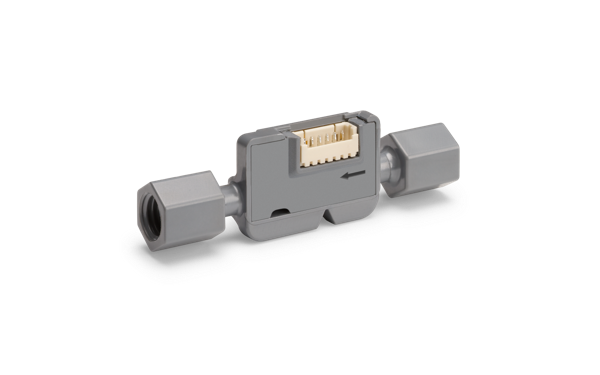
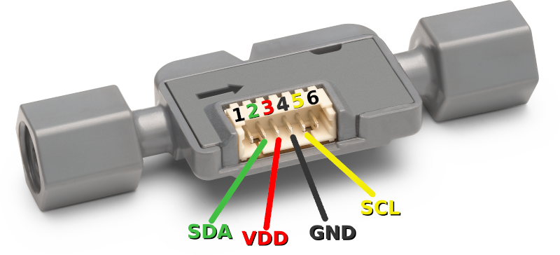

# Sensirion I2C SF06-LF Arduino Library

This document explains how to set up a sensor of the SF06-LF sensor family to run on a Arduino

<center></center>

Click [here](https://sensirion.com/products/product-categories/liquid-flow/
) to learn more about the Sensirion SF06-LF sensor family.


Not all sensors of this driver family support all measurements.
In case a measurement is not supported by all sensors, the products that
support it are listed in the API description.


## Supported sensor types

   - SLF3C-1300F

   - SLF3S-1300F

   - SLF3S-0600F

   - SLF3S-4000B

   - LD20-0600L

   - LD20-2600B

The following instructions and examples use a *SLF3C-1300F*.Click [here](https://sensirion.com/media/documents/F3931025/621F8CCE/Sensirion_Liquid_Flow_Meters_SLF3C-1300F_Datasheet.pdf
) to download the datasheet.


## Setup Guide

### Connecting the Sensor

Your sensor has the four different connectors: VDD, GND, SDA, SCL. Use
the following pins to connect your SF06-LF:



| *Pin* | *Cable Color* | *Name* | *Description*  | *Comments* |
|-------|---------------|:------:|----------------|------------|
| 1 |  |NC | Do not connect | 
| 2 | green |SDA | I2C: Serial data input / output | 
| 3 | red |VDD | Supply Voltage | 3.2 to 3.8V
| 4 | black |GND | Ground | 
| 5 | yellow |SCL | I2C: Serial clock input | 
| 6 |  |NC | Do not connect | 


You can find the pinout for specific boards under following links:
* [Arduino Uno](pinouts/arduino-uno-rev3.md)
* [Arduino Nano](pinouts/arduino-nano.md)
* [Arduino Micro](pinouts/arduino-micro.md)
* [Arduino Mega 2560](pinouts/arduino-mega-2560-rev3.md)
* [ESP32 DevKitC](pinouts/esp32-devkitc.md)

### Installation of Arduino

This library can be installed using the Arduino Library manager:
Start the [Arduino IDE](http://www.arduino.cc/en/main/software) and open
the Library Manager via

    Sketch => Include Library => Manage Libraries...

Search for the `Sensririon I2C SF06-LF` library in the `Filter
your search...` field and install it by clicking the `install` button.

If you cannot find it in the library manager, download the latest release as .zip file 
and add it to your [Arduino IDE](http://www.arduino.cc/en/main/software) via

	Sketch => Include Library => Add .ZIP Library...

Don't forget to **install the dependencies** listed below the same way via library 
manager or `Add .ZIP Library`

#### Dependencies

* [Sensirion Core](https://github.com/Sensirion/arduino-core)


## Quick Start

1. Connect the SF06-LF Sensor to your Arduino board's standard
   I2C bus. Check the pinout of your Arduino board to find the correct pins.
   The pinout of the SF06-LF Sensor is described above.

   The recommended voltage is 3.3V.

2. Open the `exampleUsage` sample project within the Arduino IDE via the application menu

		File => Examples => Sensirion I2C SF06-LF => exampleUsage

   The example is configured to run with a SLF3C-1300F, I2C address 0x08.
   In case you need a different address change it in the code of `examples/exampleUsage.ino`. You find the list with pre-defined 
   addresses for the supported sensors in the `src/SensirionI2CSf06Lf.h`.


3. Click the `Upload` button in the Arduino IDE or

		Sketch => Upload

4. When the upload process has finished, open the `Serial Monitor` or `Serial
   Plotter` via the `Tools` menu to observe the measurement values. Note that
   the `Baud Rate` in the corresponding window has to be set to `115200 baud`.

## Contributing

**Contributions are welcome!**

We develop and test this driver using our company internal tools (version
control, continuous integration, code review etc.) and automatically
synchronize the master branch with GitHub. But this doesn't mean that we don't
respond to issues or don't accept pull requests on GitHub. In fact, you're very
welcome to open issues or create pull requests :)

This Sensirion library uses
[`clang-format`](https://releases.llvm.org/download.html) to standardize the
formatting of all our `.cpp` and `.h` files. Make sure your contributions are
formatted accordingly:

The `-i` flag will apply the format changes to the files listed.

```bash
clang-format -i src/*.cpp src/*.h
```

Note that differences from this formatting will result in a failed build until
they are fixed.


## License

See [LICENSE](LICENSE).
