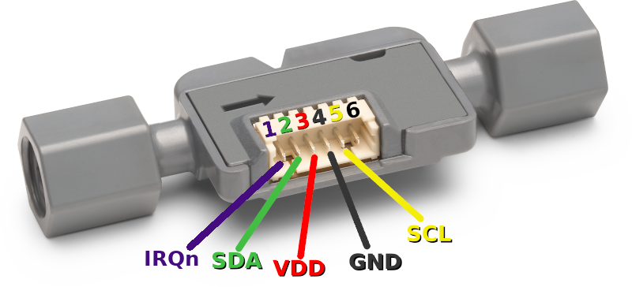
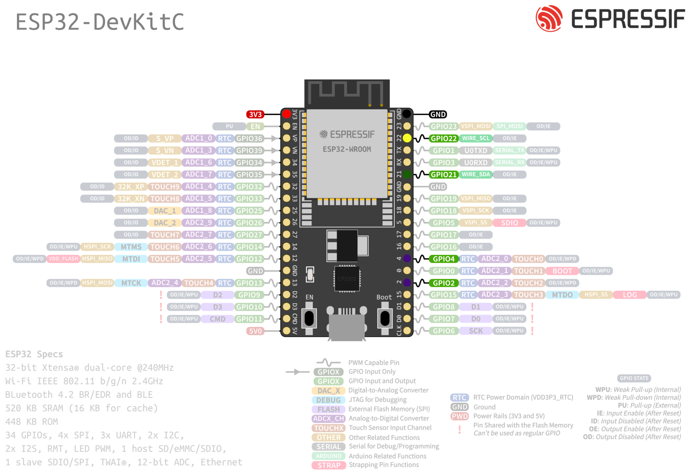
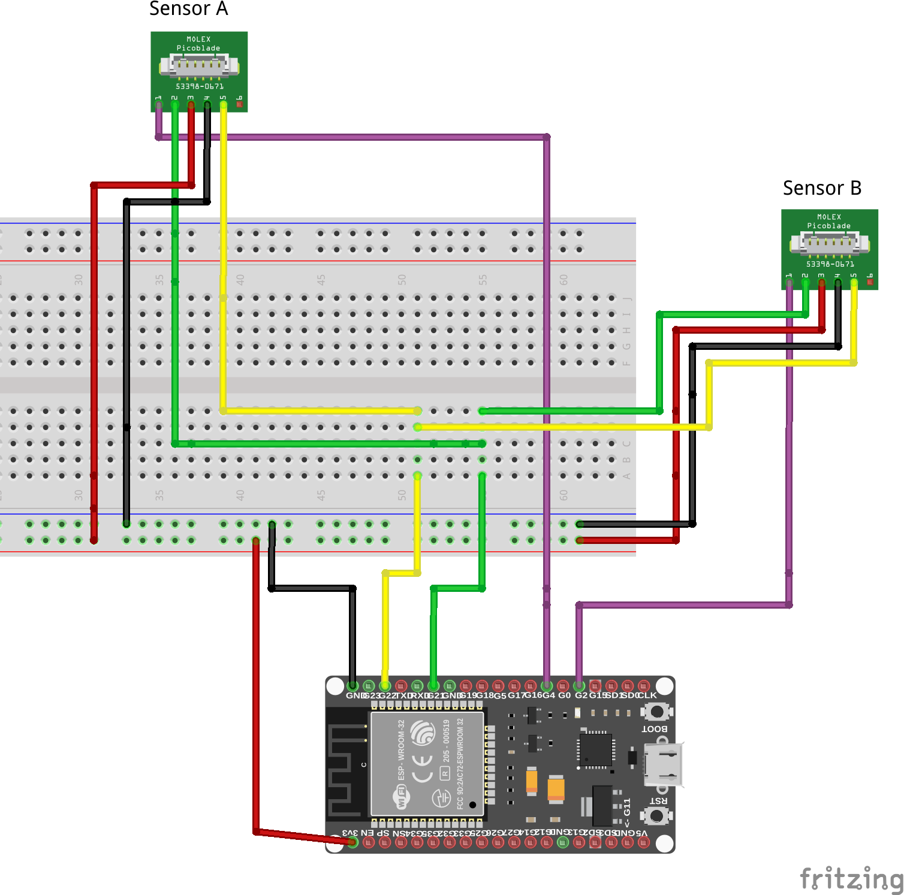

# How to change I²C Address for SLF3x Sensor

In a setup where you want to attach more than one SLF3x Sensor to the same I²C Bus you have two options. You can use a multiplexer or you change the I²C address of the attached sensors.

 This example explains how you can change the I²C address of your SLF3x sensor and subsequently reading out measurements  from both sensors. Note that the address change is not permanent, meaning that the sensor is set back to its default address after a soft reset (specific I2C command) or hard reset (power cycle).

## Setup instructions

The example is set up with an ESP32 DevKitC board and two SLF1300-F sensors attached.

### Sensor wiring

Use the following pin description to connect your SLF3x to the standard I²C bus of your Arduino board:

Connect both sensor the your ESP32 Board following the table below. 

| *SLF3x* | *SLF3x Pin* | *Cable Color* | *Board Pin* |  *Comments* |
| :---: | --- | --- | --- | --- |
| IRQn| 1 | purple | GPIO 2 / GPIO 4 | Connect IRQn pin of each sensor to its own GPIO pin on the board
| SDA | 2 | green | GPIO 21 | Connect SDA pins of all sensors to GPIO21 on the board
| VDD | 3 | red | 3V3 |
| GND | 4 | black | GND |
| SCL | 5 | yellow | GPIO 22 | Connect SCL pins of all sensors to GPIO22 on the board

To be able to connect the SDA, SCL, VDD and GND of both
sensors to the same pin on the ESP32 Board, you can for example use a Breadboard and wire the sensors as shown below.

### Adapt and run example code

* Open the example `exampleI2cAddressChange.ino` in Arduino IDE
* Check that the defines for the IRQn pins match with wiring, for the wiring exaplained above it should be
    * `#define IRQN_PIN_SENSOR_A 4`
    * `#define IRQN_PIN_SENSOR_B 2`
* You can change the I²C address to use by changing the following lines. You can use any valid I²C address in the range of 0x0 to 0x7F.
    * `#define I2C_ADDR_SENSOR_A 0x0A`
    * `#define I2C_ADDR_SENSOR_B 0x0B`
* Compile and run the example
* If everything worked out well, you will get measurement readings for both sensors attached on the serial output (use Baudrate of 115200)

Detailed Address Change Sequence

1. Send I2C Address change command to default sensor address 0x08. This command is recieved by all SLF3x sensors on the bus still having the default address.
2. Select the sensor which should accept the new I2C address sent in step 1 by sending a high pulse of at least 150μs to its IRQn Pin.
   * To do so, set the GPIO Pin of the board where the IRQn Pin of the sensor is connected to output mode and set it to a high state for at least 150μs.
   * The sensor waits for such a pulse on the IRQn Pin for 1.5ms after the I2C address change command has been sent.
3. Change the GPIO Pin back to low state and switch it to INPUT mode. You might want to configure it with a pulldown to avoid unintended high state.
4. Wait until 1.5ms have elapsed after sending the I2C address change command.
5. Read out the GPIO Pin, which should be set to high state for 200μs if the sensor changed its I2C address successfully.

## Limitations

- The feature is only supported by SLF3x sensors with a serial number above 23xxxxxxxx.
- After a soft or hard reset the  I²C address is set back to the default address 0x08. A soft reset is triggered by a speical I2C command, see `i2c_soft_reset()` in the example, and a hard reset is triggered by a power cylce of the sensor.

## Further readings

[Application note SLF3x I2C Address change](https://www.sensirion.com/media/documents/15D8B73E/6614FAE3/LQ_AN_SLF3x-I2C-Address-change.pdf)
